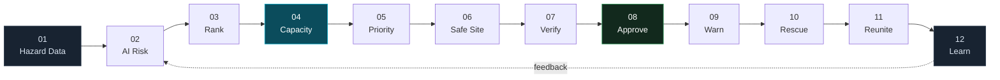
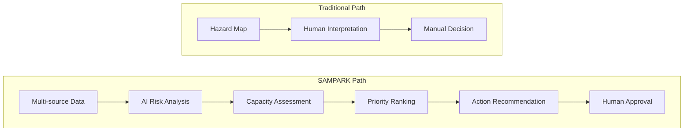
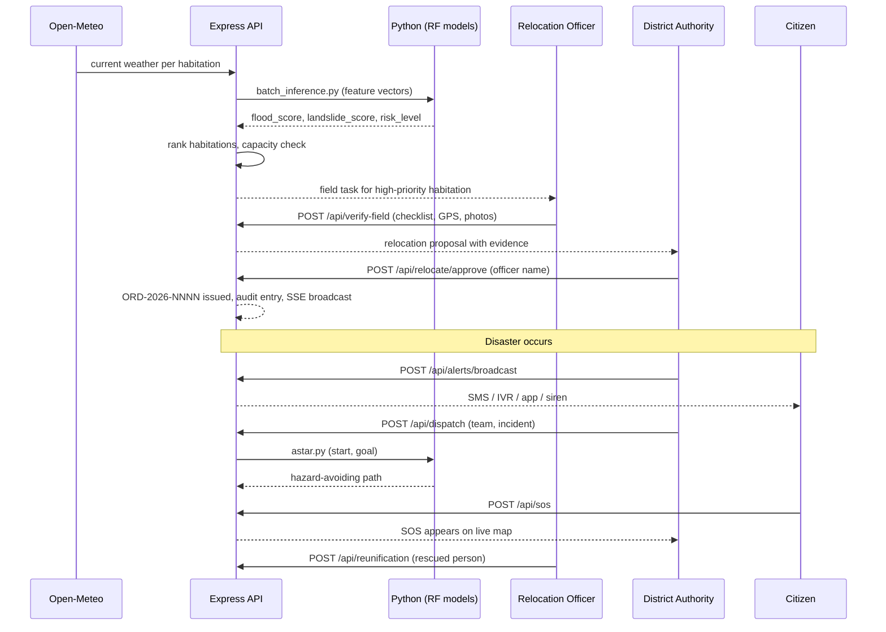
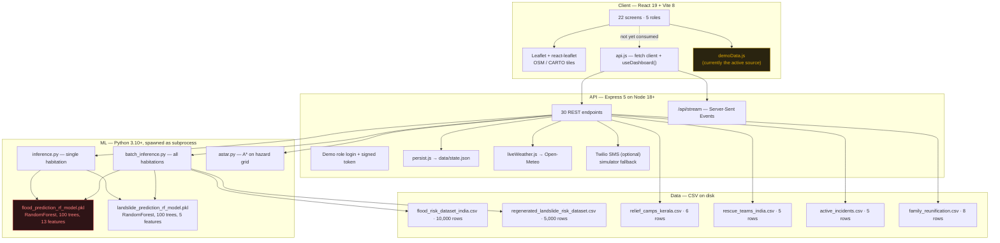
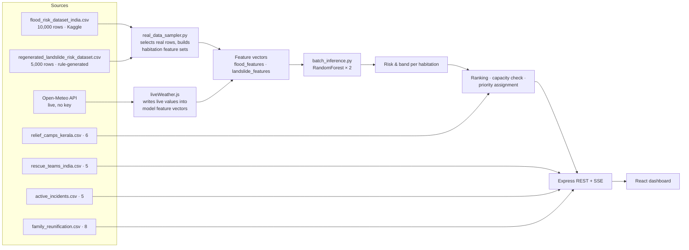
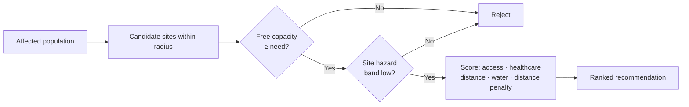

# SAMPARK

**Hazard Red Zone Intelligence & Relocation Decision Support**

> Hazard maps tell you *where* the danger is. SAMPARK tries to answer *who moves first, whether there is room for them, and how they get there safely.*

[](https://sih.gov.in)
[](#problem-statement)
[](#current-status--honest-assessment)
[](#technology-stack)
[](#technology-stack)
[](#aiml-architecture)

## Team **The Invincible Trident** · IIT Madras BS Degree Programme

### **🔗Live demo:** https://iitm-hackathon-internal-backend.vercel.app/    
[](https://iitm-hackathon-internal-backend.vercel.app/)

---

## Project Summary

```yaml
PROJECT:        SAMPARK — Hazard Red Zone Intelligence & Relocation Decision Support
DOMAIN:         Disaster Management · Geospatial Decision Support · Applied ML
PROBLEM:        Hazard maps identify danger zones but do not rank habitations by
                action priority, do not test whether a settlement exceeds its safe
                carrying capacity, and do not connect that planning data to live
                alerting, rescue routing and family reunification.
CORE_SOLUTION:  A two-phase decision chain. Proactive: multi-hazard risk scoring →
                habitation ranking → carrying-capacity check → relocation priority →
                safe-site match → field verification → authority approval.
                Reactive: geo-targeted alert → rescue dispatch → hazard-aware route →
                family reunification.
AI_ROLE:        Two scikit-learn RandomForest classifiers (flood binary, landslide
                4-class) score each habitation from weather + terrain features.
                A* search on a hazard-cost grid produces the rescue route.
PRIMARY_USERS:  District Disaster Authority · Relocation Officer · NDRF/SDRF ·
                Citizen · Administrator
KEY_OUTPUTS:    Risk score 0–100 · risk band · relocation priority · capacity verdict ·
                safe-site recommendation · hazard-avoiding route · alert dispatch log ·
                signed relocation order · family match record
CURRENT_STATUS: Working prototype. Backend ML pipeline runs end to end. The React UI
                currently renders bundled demo data and is NOT yet wired to the live
                API — see "Current Status" for the precise breakdown.
TECH_STACK:     React 19 · Vite 8 · Leaflet · Express 5 · Node 18+ · Python 3.10+ ·
                scikit-learn · pandas · joblib · Twilio (optional) · Open-Meteo
UNIQUE_VALUE:   Carrying-capacity assessment as a first-class decision input, and one
                shared pipeline driving both pre-disaster planning and live response.
SIH_ALIGNMENT:  SIH26191 — red zone identification, carrying capacity assessment,
                immediate relocation needs for vulnerable habitations.
```

---

## Table of Contents

- [Problem Statement](#problem-statement)
- [The Core Problem](#the-core-problem)
- [Our Solution](#our-solution)
- [Why Existing Approaches Are Not Enough](#why-existing-approaches-are-not-enough)
- [Key Innovation](#key-innovation)
- [Current Status — Honest Assessment](#current-status--honest-assessment)
- [Feature Matrix](#feature-matrix)
- [End-to-End Workflow](#end-to-end-workflow)
- [System Architecture](#system-architecture)
- [AI/ML Architecture](#aiml-architecture)
- [Evaluation & Metrics](#evaluation--metrics)
- [Data Architecture](#data-architecture)
- [Risk Scoring](#risk-scoring)
- [Carrying Capacity Assessment](#carrying-capacity-assessment)
- [Habitation Prioritization](#habitation-prioritization)
- [Safe-Site Recommendation](#safe-site-recommendation)
- [Hazard-Aware Routing](#hazard-aware-routing)
- [Emergency Evacuation vs Long-Term Relocation](#emergency-evacuation-vs-long-term-relocation)
- [Explainability](#explainability)
- [Dashboard & Analytics](#dashboard--analytics)
- [Real-World Scenario](#real-world-scenario)
- [Impact](#impact)
- [Technology Stack](#technology-stack)
- [Repository Structure](#repository-structure)
- [API Documentation](#api-documentation)
- [Installation](#installation)
- [Configuration](#configuration)
- [Running the Project](#running-the-project)
- [Deployment](#deployment)
- [Security & Privacy](#security--privacy)
- [Limitations](#limitations)
- [Future Roadmap](#future-roadmap)
- [SIH Alignment](#sih-alignment)
- [Demo Flow](#demo-flow)
- [Team](#team)
- [Why This Project Stands Out](#why-this-project-stands-out)
- [Conclusion](#conclusion)

---

## Status Legend

Every claim in this document carries one of four labels. This distinction is deliberate and is applied strictly.

| Label | Meaning |
|---|---|
| ✅ **Implemented** | Code exists in this repository and runs |
| 🟡 **Partial** | Code exists but is incomplete, disconnected, or operates on demonstration data |
| 🔵 **Planned** | Designed and specified, not yet built |
| ⚪ **Future Scope** | Aspirational, dependent on access or resources we do not currently have |

---

## Problem Statement

**SIH26191 — Intelligent Identification of Hazard-Based Red Zones, Carrying Capacity Assessment, and Immediate Relocation Needs for Vulnerable Habitations.**

Theme: Disaster Management · Category: Software

---

## The Core Problem

India already has hazard information. The Geological Survey of India publishes landslide susceptibility maps. IMD issues rainfall warnings. NDMA operates SACHET for common alerting. None of these are broken.

The gap is what happens **after** the hazard is known.

A district officer facing a monsoon alert holds a map with red patches on it. That map does not tell them:

| Question the officer actually has | What a hazard map provides |
|---|---|
| Which of my 40 habitations do I handle first? | Undifferentiated red polygons |
| How many people are inside each polygon? | Nothing |
| Can this village still safely hold the people living in it? | Nothing |
| Where do I move them, and is there room there? | Nothing |
| Is the road out still usable? | Nothing |
| Why is this ranked above that? Can I defend it in writing? | Nothing |

Six specific failure modes follow from that gap:

1. **Fragmented data.** Hazard, population, infrastructure and road data live in different formats, at different resolutions, updated on different cycles. Nobody joins them under time pressure.
2. **Static hazard maps.** A susceptibility layer published quarterly cannot respond to 72 hours of rainfall.
3. **No habitation-level prioritization.** Zone-level risk does not resolve to a work queue.
4. **No carrying-capacity test.** A settlement can be inside a moderate hazard zone and still be the most urgent case because it holds twice the people its water supply can sustain.
5. **Shelter capacity is discovered too late.** People are moved to a site that is already full.
6. **Unexplainable prioritization.** An officer will not sign a relocation order on the strength of a number with no reasoning attached, and should not be asked to.

**The distinction this project is built around:**

> *Knowing where the hazard is* ≠ *Knowing which habitation to act on first, why, and where those people should go.*

---

## Our Solution

SAMPARK is a district-level decision-support system built as a **12-stage decision chain**. Every screen in the application maps to exactly one stage, and the chain is rendered as a persistent navigation rail so the user always knows where in the workflow they are.



Stages 01–08 run **before** a disaster (proactive planning). Stages 09–12 run **during and after** one (reactive response). Both halves consume the same risk, population and geography data — that shared pipeline is the point.

---

## Why Existing Approaches Are Not Enough

| System | What it does well | What it does not do |
|---|---|---|
| **NDMA SACHET** | Authoritative national common alerting protocol, wide reach | Does not rank habitations, does not assess carrying capacity, does not plan relocation |
| **GSI susceptibility maps** | Rigorous geological zonation | Static, zone-level, no population overlay, no action priority |
| **IMD warnings** | Accurate meteorological forecasting | Weather, not human exposure or settlement capacity |
| **Google Maps / OSRM** | Excellent shortest-path routing | Not hazard-aware. Will route a rescue vehicle through a flooded road because it is shorter |

**SAMPARK does not replace any of these.** It is a district-level layer that sits underneath them and converts their outputs into a ranked, evidence-backed action list. National warning infrastructure remains the authoritative channel.

---

## Key Innovation



We call this **Risk-to-Action Intelligence**. Three things distinguish it:

**1. Carrying capacity as a first-class input.** Most disaster tools model hazard and exposure. SAMPARK additionally asks whether the settlement can sustain its current population across five resource dimensions, and uses the **weakest** dimension — not the average — as the binding constraint. A village whose water supply sustains 1,900 people but which houses 3,240 is over capacity by 70%, regardless of how much spare road width it has.

**2. Red zone ≠ action priority.** These are separated deliberately. See [Habitation Prioritization](#habitation-prioritization).

**3. One pipeline, two phases.** The same habitation records, risk scores and geography that drive pre-disaster relocation planning also drive live alerting and rescue routing. There is no second system to reconcile during an emergency.

---

## Current Status — Honest Assessment

This section exists because the rest of the document is only trustworthy if this one is accurate.

### What genuinely runs today

| Component | Status | Evidence in repo |
|---|---|---|
| Express API server, 30 endpoints | ✅ Implemented | `backend/server.js` (1,024 lines) |
| Flood risk RandomForest model | ✅ Implemented | `ai_model/flood_prediction_rf_model.pkl`, `train_model.py` |
| Landslide risk RandomForest model | ✅ Implemented | `ai_model/landslide_prediction_rf_model.pkl`, `train_landslide_model.py` |
| Python inference invoked from Node | ✅ Implemented | `backend/inference.py`, `batch_inference.py`, `child_process.spawn` |
| A* hazard-aware routing | ✅ Implemented | `ai_model/astar.py` |
| Live weather ingestion (Open-Meteo, no API key) | ✅ Implemented | `backend/liveWeather.js` |
| Weather scenario switching with model re-scoring | ✅ Implemented | `POST /api/weather/scenario` |
| Server-Sent Events live refresh | ✅ Implemented | `GET /api/stream` |
| SMS dispatch via Twilio, with simulator fallback | ✅ Implemented | `POST /api/send-real-sms` |
| Field verification submission | ✅ Implemented | `POST /api/verify-field` |
| Relocation approval with signed order ID | ✅ Implemented | `POST /api/relocate/approve` |
| Rescue team dispatch | ✅ Implemented | `POST /api/dispatch` |
| Family reunification register | ✅ Implemented | `/api/reunification` routes |
| JSON file state persistence | ✅ Implemented | `backend/persist.js` |
| React 19 SPA, 22 screens, 5 roles | ✅ Implemented | `src/pages/*.jsx` |
| Leaflet map with OSM tiles | ✅ Implemented | `react-leaflet` in `Command.jsx`, `RiskMap.jsx`, `Route.jsx` |
| Role-based navigation and demo login | ✅ Implemented | `src/App.jsx`, `POST /api/login` |

### What is incomplete, and how

| Gap | Status | Detail |
|---|---|---|
| **Frontend is not wired to the backend** | 🟡 Partial | `useDashboard()` in `src/api.js` fetches all live endpoints and `App.jsx` passes the result down as `pageProps.data`. However, **18 of 22 page components import bundled constants from `src/demoData.js` instead of reading that prop.** The UI therefore renders static demonstration data even when the API is running. Only `POST /api/login` is actually consumed by the UI. |
| **Two different geographies** | 🟡 Partial | The backend operates on Kerala (Munnar, Aluva, Wayanad; `relief_camps_kerala.csv`). The frontend demo data describes Chamoli district, Uttarakhand. These need to be unified. |
| **Carrying capacity is frontend-only** | 🟡 Partial | The five-dimension breakdown and `min()` bottleneck logic live in `src/risk.js` and `src/demoData.js`, operating on hardcoded values. The backend computes only a binary `capacityMatch: "OK" \| "OVER_CAPACITY"` (`server.js:309`). |
| **Flood model has no predictive skill** | 🟡 Partial | Measured ROC-AUC 0.502 on held-out data. See [Evaluation & Metrics](#evaluation--metrics). The pipeline works; the dataset does not support the task. |
| **A\* runs on a synthetic grid** | 🟡 Partial | `ai_model/astar.py` uses a hardcoded 20×20 hazard grid, not a real road network. |
| **No database** | 🔵 Planned | State persists to `backend/data/state.json`. No PostgreSQL, no PostGIS. |
| **No automated tests** | 🔵 Planned | `backend/package.json` test script exits with an error. |
| **Authentication is demo-grade** | 🔵 Planned | Role selection issues a token; session held in `localStorage`. No password verification, no real authorization checks on endpoints. |
| **Explainability** | 🔵 Planned | Feature importances are available from the trained RandomForest models but are not currently surfaced in the API or UI. The AI Risk screen displays static illustrative drivers. |

> **A note on `SAMPARK_ARCHITECTURE.md`:** the architecture document in this project describes a target stack (Next.js, TypeScript, PostgreSQL + PostGIS, Redis, Socket.io, FastAPI, NextAuth). **None of that is what this repository currently contains.** Treat that document as the roadmap, and this README as the state of the code.

---

## Feature Matrix

| Feature | Description | Input | Processing | Output | Status | AI/ML Role | Real-World Use |
|---|---|---|---|---|---|---|---|
| **Multi-Hazard Risk Analysis** | Scores flood and landslide risk per habitation | Rainfall, humidity, temperature, water level, river discharge, elevation, soil moisture, land cover, soil type, population density | Two RandomForest classifiers; combined score = `max(flood, landslide)` | Risk score 0–100, band LOW/MODERATE/HIGH/CRITICAL | ✅ Implemented | Core — both models are the scorer | Officer sees which villages are in danger now |
| **Live Weather Ingestion** | Pulls current conditions into model features | Habitation lat/lng | Open-Meteo forecast + flood API, no key required | Updated feature vectors, model re-scored | ✅ Implemented | Feeds the model | Risk score responds to today's rain |
| **Weather Scenario Simulation** | Switch NORMAL / SEVERE_MONSOON / CYCLONIC_STORM / LIVE | Scenario name | Overwrites telemetry, triggers batch re-inference | New scores for all habitations | ✅ Implemented | Re-runs both models | Tabletop exercise, demo |
| **Habitation Ranking** | Orders habitations by composite score | Scored habitation set | Sort + filter | Ranked table | 🟡 Partial (UI on demo data) | Consumes model output | Work queue for the officer |
| **Carrying Capacity Assessment** | Population vs safe capacity across 5 resources | Population, per-resource capacity | `safeCap = min(Housing, Water, Healthcare, Emergency, Access)`; `overload = (pop − cap)/cap` | Capacity verdict, overload %, binding constraint | 🟡 Partial (frontend, hardcoded values) | None — deterministic | Decides whether relocation is needed at all |
| **Relocation Priority Engine** | Assigns P1–P4 | Risk, vulnerability, overload, accessibility | Threshold gates | Priority label + reasoning | 🟡 Partial (demo data) | Consumes model output | Tells officer what to do first |
| **Safe-Site Matching** | Ranks candidate shelters | Camp capacity, occupancy, distance, site risk, access, healthcare distance | Suitability scoring | Ranked shelter list with recommendation | 🟡 Partial | None currently | Prevents sending people to a full site |
| **Field Verification** | Human ground-truthing of AI flags | Checklist, GPS, photos, narrative | Submitted and stored | Verification record, habitation status change | ✅ Implemented (API) | Human-in-the-loop check on AI | Evidence for a legally defensible order |
| **Authority Approval** | Signed relocation order | Officer name, proposal | Generates `ORD-YYYY-NNNN` id, persists, broadcasts | Signed order | ✅ Implemented | None — deliberately human | Accountability |
| **Geo-Targeted Alerts** | Multi-channel warning | Hazard, area, severity, message, channels | Twilio SMS or simulator; browser speech for IVR | Delivery log | ✅ Implemented | None | Last-mile warning |
| **Rescue Dispatch** | Assign team to incident | Team id, incident id | Status transition, persist, broadcast | Dispatch record | ✅ Implemented | None | Coordination |
| **Hazard-Aware Routing** | Safest, not shortest, path | Start, goal on hazard grid | A* with cell costs 1 / 8 / 100 | Path, cost, safety rating, ETA | ✅ Implemented (synthetic grid) | Classical search algorithm | Rescue vehicle avoids the flooded road |
| **Family Reunification** | Register, search, mark reunited | Person record, camp | Store, search, status update | Reunification record | ✅ Implemented | None | Reduces post-rescue panic |
| **Citizen SOS** | Distress signal with location | Lat/lng, message | Stored, appears on map | SOS record | ✅ Implemented | None | Direct citizen channel |
| **Analytics** | Risk distribution, priorities, utilisation | Aggregated state | Aggregation | Charts, counters | 🟡 Partial (demo data) | None | Situational awareness |
| **What-If Simulator** | Compare intervention scenarios | Rainfall, river level, road status, lead time | Deterministic formula | Exposure and delay comparison | 🟡 Partial (illustrative formula, clearly labelled) | None | Argument for pre-positioning |
| **Explainable Risk** | Why this score? | Model + features | Feature importance extraction | Ranked drivers | 🔵 Planned | SHAP or native RF importances | Officer trust |
| **Audit Log** | Immutable record of decisions | All state-changing actions | Append | Audit trail | ✅ Implemented | None | Accountability |

---

## End-to-End Workflow



---

## System Architecture



The dashed edge and the two highlighted nodes are the two known weak points, documented in [Current Status](#current-status--honest-assessment).

---

## AI/ML Architecture

> **Status: ✅ Implemented, with a significant caveat on the flood model. Read [Evaluation & Metrics](#evaluation--metrics) before citing any performance claim.**

### Model 1 — Flood Risk

| Property | Value |
|---|---|
| Algorithm | `RandomForestClassifier(n_estimators=100, random_state=42)` |
| Task | Binary classification — `Flood Occurred` ∈ {0, 1} |
| Features | 13 — Latitude, Longitude, Rainfall (mm), Temperature (°C), Humidity (%), River Discharge (m³/s), Water Level (m), Elevation (m), Land Cover, Soil Type, Population Density, Infrastructure, Historical Floods |
| Categorical handling | `LabelEncoder` on Land Cover, Soil Type; encoders persisted to `label_encoders.pkl` |
| Training data | `flood_risk_dataset_india.csv`, 10,000 rows, 80/20 split |
| Output | `predict_proba()[1] × 100` → flood score 0–100 |
| Artefact | `ai_model/flood_prediction_rf_model.pkl` |

### Model 2 — Landslide Risk

| Property | Value |
|---|---|
| Algorithm | `RandomForestClassifier(n_estimators=100, random_state=42)` |
| Task | 4-class classification — Low / Moderate / High / Very High |
| Features | 5 — Temperature (°C), Humidity (%), Precipitation (mm), Soil Moisture (%), Elevation (m) |
| Training data | `regenerated_landslide_risk_dataset.csv`, 5,000 rows, 80/20 split |
| Output | Class → score map: Low 25, Moderate 55, High 85, Very High 98 |
| Artefact | `ai_model/landslide_prediction_rf_model.pkl` + `landslide_label_encoder.pkl` |

### Combination

```python
# backend/inference.py
combined_score = max(flood_score, landslide_score)
risk_level = ("CRITICAL" if combined_score >= 75 else
              "HIGH"     if combined_score >= 50 else
              "MODERATE" if combined_score >= 25 else "LOW")
```

A `max()` combiner is used rather than a weighted sum. The reasoning: for evacuation purposes, a habitation facing one critical hazard is critical, and averaging a critical flood score with a low landslide score would mask that. This is a defensible choice but a coarse one — a calibrated weighted model is [Planned](#future-roadmap).

### Inference paths

- **Single habitation** — `backend/inference.py` invoked via `spawn(PYTHON_EXE, [script, JSON.stringify(input)])`
- **All habitations** — `backend/batch_inference.py` invoked via `execSync` with a temp file, models loaded once in memory
- **Fallback** — if a model fails to load, `inference.py` returns hardcoded neutral scores (flood 50.0, landslide 40.0) so the API stays up. This is a demo-resilience measure, not a modelling decision.

### Model 3 — A* Hazard-Aware Routing

> **Status: ✅ Implemented on a synthetic grid.**

```python
# ai_model/astar.py
CELL_COST = {
    0: 1,    # safe — normal cost
    1: 8,    # moderate risk — discouraged
    2: 100   # red zone — almost impassable
}
```

A* with a Manhattan-distance heuristic over a hardcoded 20×20 grid representing a flood-prone region. Red-zone cells carry 100× the traversal cost of safe cells, so the optimal path bends around hazard rather than through it — producing a **safe** route, not a **short** one.

**This is the conceptual core of our routing differentiator.** The limitation is that the grid is synthetic. Replacing it with a real OSM road graph weighted by hazard polygons is the top item on the roadmap.

---

## Evaluation & Metrics

> **These are real measured numbers, produced by loading the committed `.pkl` artefacts and evaluating them against the same held-out split used in training. Nothing here is estimated or aspirational.**

### Flood Model — measured on 2,000 held-out rows

| Metric | Value |
|---|---|
| Accuracy | **0.505** |
| ROC-AUC | **0.502** |
| Majority-class baseline | 0.517 |
| Precision (class 1) | 0.523 |
| Recall (class 1) | 0.499 |
| F1 (class 1) | 0.511 |

> ⚠️ **The flood model currently performs at chance level.** An ROC-AUC of 0.502 means the model is not distinguishing flood from no-flood. The class balance in the dataset is near-perfect (5,057 / 4,943), and every one of the 13 features carries a feature importance of approximately 0.10 — the signature of a model that found no signal to learn from.
>
> The most likely explanation is that `flood_risk_dataset_india.csv` is a synthetically generated dataset in which the label is independent of the features. **The engineering pipeline is sound; the training data is not fit for the task.** We are documenting this rather than reporting the training-run accuracy, because a model that cannot beat a coin flip must not be presented as operational intelligence.
>
> **Remediation (in progress):** replace with observation-linked flood records — CWC river gauge series joined to IMD rainfall and recorded inundation events — and retrain. See [Roadmap Phase 2](#future-roadmap).

### Landslide Model — measured on 1,000 held-out rows

| Metric | Value |
|---|---|
| Accuracy | **0.998** |
| Macro F1 | 0.997 |
| Class distribution | Low 4,591 · Moderate 334 · High 63 · Very High 12 |

> ⚠️ **This number should not be read as skill.** We verified that across all 5,000 rows there are **zero cases of identical feature vectors carrying conflicting labels**. The label is a deterministic function of the five input features, which means the dataset was rule-generated and the model has memorised the generating rule rather than learned geomorphology.
>
> Reporting "99.8% accuracy" without this caveat would be misleading. The model is a fast, faithful reimplementation of a threshold rule — useful as a pipeline component, not as evidence of predictive capability.

### Routing

| Metric | Status |
|---|---|
| Path optimality on the synthetic grid | ✅ Correct by construction (A* with an admissible heuristic) |
| Validation against real road networks | 🔵 Planned |

### Not yet measured

Calibration curves, inference latency under load, ranking quality (NDCG) against officer-assigned priorities, and inter-rater agreement between model output and field verification. All 🔵 **Planned**.

---

## Data Architecture



### Dataset inventory

| File | Rows | Source | Purpose | Preprocessing |
|---|---|---|---|---|
| `flood_risk_dataset_india.csv` | 10,000 | Public dataset (Kaggle) | Train flood classifier | Mean-impute numerics, mode-impute categoricals, LabelEncode Land Cover + Soil Type |
| `regenerated_landslide_risk_dataset.csv` | 5,000 | Rule-generated | Train landslide classifier | Mean-impute, LabelEncode target |
| `relief_camps_kerala.csv` | 6 | Authored for prototype | Shelter capacity, occupancy, supplies, coordinates | Loaded directly |
| `rescue_teams_india.csv` | 5 | Authored for prototype | Team roster, status, specialisation | Loaded directly |
| `active_incidents.csv` | 5 | Authored for prototype | Live incident seeding | Loaded directly |
| `family_reunification.csv` | 8 | Authored for prototype | Reunification register seed | Loaded directly |
| **Open-Meteo** | live | `api.open-meteo.com` | Temperature, humidity, precipitation, soil moisture, elevation, river discharge | Written into model feature vectors; water level estimated from rain + discharge |

> **Honest note on Open-Meteo:** `liveWeather.js` documents its own limitation in a header comment — IMD AWS and CWC gauge water level are not available without official keys, so water level is *estimated* from rainfall and discharge. That estimate feeds the flood model. It is a reasonable proxy and it is labelled as one.

### Not currently integrated

⚪ **Future Scope** — GSI landslide susceptibility layers, IMD AWS station feeds, CWC river gauge API, Census 2011 population at habitation granularity, satellite imagery, PostGIS spatial queries, NDMA SACHET / Cell Broadcast.

---

## Risk Scoring

### Implemented

```
flood_score      = P(flood = 1) × 100                    # RandomForest, 13 features
landslide_score  = class_score_map[predicted_class]      # {Low:25, Moderate:55, High:85, Very High:98}
combined_score   = max(flood_score, landslide_score)

risk_level = CRITICAL  if combined_score >= 75
             HIGH      if combined_score >= 50
             MODERATE  if combined_score >= 25
             LOW       otherwise
```

### Proposed conceptual framework — 🔵 Planned

The current combiner uses only hazard likelihood. A fuller risk formulation, specified but **not yet implemented**, would compose:

```
Risk = w₁·HazardExposure + w₂·Vulnerability + w₃·PopulationExposure
     + w₄·HistoricalRecurrence + w₅·AccessibilityConstraint
```

Weights would be fitted against officer-assigned priorities rather than assumed. **We are not publishing weights we have not calibrated.**

### Why interpretability is non-negotiable

An officer signing a relocation order is making a legally consequential decision affecting thousands of people. "The model said 87" is not a defensible basis. The target output shape is:

```
Risk Score:  87 / 100        Band: HIGH        Confidence: 84%

Contributing factors (illustrative shape — feature attribution is Planned):
  Rainfall intensity, 72 h            +24
  Distance to river channel           +21
  Population inside hazard polygon    +16
  Road-link vulnerability             +12
  Historical event recurrence          +9
```

> The numbers above are an **example of the intended output format**, not current system output. The trained RandomForest models do expose `feature_importances_`, which gives us a credible path to global attribution; per-prediction attribution via SHAP is 🔵 Planned.

---

## Carrying Capacity Assessment

> **This is our primary differentiator. Status: 🟡 Partial — logic implemented in the frontend on hardcoded per-habitation values; backend computes only a binary verdict.**

Safe capacity is evaluated across five resource dimensions, each expressed as *the number of people that resource can sustain*:

| Dimension | Conceptual basis |
|---|---|
| **Housing** | Habitable structures × mean household size, minus structures rated fragile |
| **Water** | Assured dry-season yield ÷ per-capita daily requirement |
| **Healthcare** | Beds and staff reachable within a travel-time threshold |
| **Emergency shelter** | Usable floor area ÷ per-person space norm |
| **Road / evacuation access** | Evacuation throughput of the road network in a fixed window |

```javascript
// src/risk.js — implemented
export function safeCap(capObj) {
  return Math.min(...Object.values(capObj))     // the weakest resource binds
}
export function overload(pop, cap) {
  return Math.round(((pop - cap) / cap) * 1000) / 10
}
```

**Why `min()` and not `mean()`.** Averaging the five would let a generous road network mask a water shortfall. You cannot drink road width. The binding constraint is the weakest resource, and identifying *which* resource binds is itself the actionable output — it tells the district what to fix.

**Worked example (demonstration data):**

```
Habitation:      Raini Gaon
Population:      3,240
Housing:         2,400
Water:           1,900   ← binding constraint
Healthcare:      2,150
Emergency:       2,050
Access:          2,600

Safe capacity:   1,900
Over capacity:   +70.5%
Verdict:         CRITICAL OVERCAPACITY
Action:          Water is the constraint. Either augment supply or relocate.
```

> The per-resource figures are **demonstration values authored for the prototype**, not survey data. Deriving them from real sources — PHC registers, water board yield data, building surveys — is 🔵 Planned. The norms used should come from the state relief manual, not from us.

---

## Habitation Prioritization

> **Red Zone Identification ≠ Action Priority.** This distinction is the reason the priority engine exists as a separate stage.

| Priority | Meaning |
|---|---|
| **P1** | Immediate — relocation planning starts now |
| **P2** | Urgent — verification within the fortnight |
| **P3** | Short term — review at next monsoon cycle |
| **P4** | Monitor — passive observation |

### Why hazard alone is the wrong sort key

**A high-hazard habitation can rank lower** when it has low population, good road access, nearby shelter capacity with room, and low structural vulnerability. Fewer people, easier to move, somewhere to move them.

**A moderate-hazard habitation can rank higher** when it has high population, a large share of children and elderly, poor roads, no nearby shelter with free capacity, and repeated historical impact. More people, harder to move, nowhere ready to receive them.

Authorities have finite trucks, finite officers and finite hours. Ranking by hazard severity spends those resources on the wrong village.

### Gate thresholds — 🟡 Partial (frontend, demo data)

```
P1  risk ≥ 85  AND  (overload > 40%  OR  access = Poor)
P2  risk ≥ 70  AND  overload > 10%
P3  risk ≥ 50
P4  otherwise
```

Thresholds are currently constants in the frontend. Making them per-district configurable with audit-logged changes is 🔵 Planned.

---

## Safe-Site Recommendation

> **The nearest shelter is not necessarily the safest or the most suitable shelter.**



**Worked example (demonstration data):**

| Site | Distance | Free capacity | Site risk | Access | Healthcare | Suitability |
|---|---|---|---|---|---|---|
| **Gopeshwar Relief Campus** | 5.2 km | 2,800 | Low | Good | 2.1 km | **92%** ✅ |
| Karnaprayag ITI Ground | 8.4 km | 3,900 | Very low | Excellent | 1.4 km | 89% |
| Pipalkoti School Block | **4.1 km** | 400 | Low | Poor | 6.8 km | 61% |

The nearest site (Pipalkoti, 4.1 km) is rejected: it has 400 free places against a need in the thousands, poor road access, and the nearest health facility 6.8 km away. **Distance is a tiebreaker, not the objective function.**

> Backend status: `/api/camps` and `/api/sites` serve real capacity and occupancy from `relief_camps_kerala.csv`. The multi-criteria suitability scoring shown above is currently frontend logic on demonstration values — 🟡 Partial.

---

## Hazard-Aware Routing

> **Status: ✅ Implemented (A* on synthetic grid). Real road-network routing is 🔵 Planned.**

The distinction the system is built to express:

| | Route A | Route B |
|---|---|---|
| Distance | 8.3 km — **shorter** | 11.4 km |
| Status | Blocked by debris | Clear |
| Hazard exposure | Crosses flood zone | 0.4 km in amber, none in red |
| **Recommended** | ❌ | ✅ |

A general-purpose routing engine returns Route A, because it is optimising distance. SAMPARK returns Route B, because the A* cost function penalises hazard cells 100×.

**Planned real-network implementation:** OSM road graph via `osmnx`, edge weights multiplied by hazard-polygon intersection, solved with A*/Dijkstra in `networkx`; or a self-hosted OpenRouteService instance using its `avoid_polygons` parameter with our own hazard GeoJSON. Contraction Hierarchies must be disabled for `avoid_polygons` to take effect.

---

## Emergency Evacuation vs Long-Term Relocation

These are two different decisions with different urgency, different approval paths and different destinations. Conflating them is a common and serious modelling error.

| | **Emergency Evacuation** | **Long-Term Relocation** |
|---|---|---|
| Question | What must happen **now**? | Should this habitation be **permanently** moved? |
| Timescale | Hours | Months to years |
| Destination | Government schools, community halls, stadiums, relief camps — **temporary shelters** | Surveyed, serviced resettlement land |
| Approval | **Not blocked.** Rescue proceeds; authority is informed in parallel | Requires field evidence and an explicit signed order |
| Reversible | Yes — people return home | No |
| In this repo | `POST /api/dispatch`, `POST /api/alerts/broadcast` | `POST /api/verify-field` → `POST /api/relocate/approve` → `ORD-YYYY-NNNN` |

> A relief camp is **never** presented as a permanent relocation destination anywhere in this system. Emergency shelters are shelters.

---

## Explainability

> **Status: 🔵 Planned. The trained models expose `feature_importances_`, but this is not currently surfaced through the API or the UI.**

An authority cannot act on "AI says risk = 87." The system must answer *why*, and must expose what it does not know.

Three commitments in the design:

1. **Every score carries a confidence value and a data-vintage stamp.** A score built on a 2011 census projection and a 2025-Q4 susceptibility layer must say so.
2. **Every recommendation is traceable to evidence.** The approval screen links back to the risk assessment, the field verification record, the capacity report and the safe-site comparison.
3. **Disagreement is recorded, not suppressed.** The field verification flow explicitly compares *model prediction* against *ground finding*. Where they diverge, that divergence is the most valuable data the system produces.

Why this matters for adoption: government users are accountable for their decisions in ways a model is not. A system that cannot be explained will not be signed, and a system that is not signed is not deployed.

---

## Dashboard & Analytics

Charts included because they change a decision, not because they fill space.

| Visualization | Decision it supports | Status |
|---|---|---|
| District risk map (Leaflet, real OSM tiles) | Where is the problem, spatially? | ✅ Implemented |
| Priority actions list | What do I do first this morning? | 🟡 Partial |
| Risk distribution by band | How bad is the district overall? | 🟡 Partial |
| Hazard-wise comparison | What am I preparing for — flood or slope failure? | 🟡 Partial |
| Population exposure trend | Is exposure growing week on week? | 🟡 Partial |
| Safe-site utilisation | Am I about to run out of shelter capacity? | 🟡 Partial |
| Capacity overload per habitation | Which settlements exceed what they can sustain? | 🟡 Partial |
| Rescue response time | Is dispatch getting faster? | 🟡 Partial |

Screens implemented: Command Center, Risk Map, Habitations, AI Risk, Multi-Hazard, Carrying Capacity, Priority, Safe Sites, Field Verification, Approval, Emergency, Alerts, Rescue, Route, Family Reunification, What-If, Analytics, Data & AI, Reports, Citizen, Notifications, Settings — **22 screens, 5 role-based navigations**.

> No screenshots are included in this README because none are committed to the repository. Adding them is 🔵 Planned.

---

## Real-World Scenario

**Current prototype capability**

1. Officer signs in as District Disaster Authority. `POST /api/login` issues a session.
2. Command Center loads. Leaflet renders the district with habitations coloured by risk band.
3. Officer switches the weather scenario to `SEVERE_MONSOON`. `POST /api/weather/scenario` rewrites the telemetry and triggers `batch_inference.py`.
4. Both RandomForest models re-score every habitation. New risk bands propagate to all connected clients over SSE.
5. The highest-risk habitation surfaces at the top of the priority queue.
6. Officer opens it: flood score, landslide class, capacity verdict, safe-site match.
7. A field task is raised. The relocation officer submits a checklist, GPS fix and photographs via `POST /api/verify-field`.
8. The authority reviews the evidence and signs. `POST /api/relocate/approve` issues `ORD-2026-NNNN`, writes an audit entry, and broadcasts.
9. Incident declared. `POST /api/alerts/broadcast` sends SMS through Twilio, or through the simulator if no credentials are configured.
10. `POST /api/dispatch` assigns a team; `GET /api/route/:incidentId` runs A* and returns a hazard-avoiding path.
11. Rescued persons are registered via `POST /api/reunification` and matched against open records.

**Future operational capability** ⚪

Live IMD and CWC feeds replacing scenario switching; GSI susceptibility polygons replacing synthetic hazard cells; real OSM road routing; SACHET integration for authoritative alerting; PostGIS for spatial queries at state scale.

---

## Impact

| Stakeholder | Decision-support outcome |
|---|---|
| **District administration** | A ranked work queue instead of an undifferentiated hazard map. Every relocation order carries an evidence file and an audit trail. |
| **State disaster authority** | Comparable risk and capacity figures across districts, computed the same way. |
| **Relocation officers** | Field visits targeted at the habitations that actually need them, rather than surveyed in map order. |
| **NDRF / SDRF** | Routes that account for blockage and hazard, and a shared incident picture with the civil authority. |
| **Emergency planners** | Carrying-capacity data that identifies which settlements are structurally over-subscribed before a monsoon, not during one. |
| **Vulnerable communities** | Alerts that carry a destination and a route, not just a warning. A family register that reduces the time relatives spend searching. |
| **Relief organisations** | Shelter occupancy visible before dispatch, so people are not sent to full sites. |

We are deliberately not claiming lives saved or percentage improvements. Those numbers require a pilot deployment and a control comparison, and we have neither.

---

## Technology Stack

Only technologies actually present in this repository are listed.

| Layer | Technology | Version | Purpose |
|---|---|---|---|
| Frontend framework | React | ^19.2.8 | UI |
| Build tool | Vite | ^8.2.2 | Dev server, bundling |
| Mapping | Leaflet + react-leaflet | ^1.9.4 / ^5.0.0 | Real tile maps, OSM |
| Icons | lucide-react | ^1.35.0 | Icon set |
| Linting | oxlint | ^1.79.0 | Static analysis |
| Backend runtime | Node.js | 18+ | Server |
| API framework | Express | ^5.2.1 | REST + SSE |
| CORS | cors | ^2.8.6 | Cross-origin |
| Config | dotenv | ^16.6.1 | Environment variables |
| SMS | twilio | ^6.1.0 | Alert dispatch (optional) |
| ML runtime | Python | 3.10+ | Model inference |
| ML library | scikit-learn | ≥1.3 | RandomForest |
| Data | pandas / numpy | ≥2.0 / ≥1.26 | Preprocessing |
| Serialisation | joblib | ≥1.3 | Model artefacts |
| Weather | Open-Meteo API | — | Live telemetry, no key required |
| Persistence | JSON file | — | `backend/data/state.json` |
| Deployment | Vercel | — | Frontend SPA (`vercel.json`) |

**Not present** (contrary to what the architecture document proposes): TypeScript, Next.js, Tailwind, PostgreSQL, PostGIS, Redis, Socket.io, FastAPI, NextAuth, Docker, any test framework.

---

## Repository Structure

```
IITM-Hackathon-Internal-backend/
├── ai_model/                              # ML training, artefacts, datasets
│   ├── train_model.py                     # Flood RandomForest training
│   ├── train_landslide_model.py           # Landslide RandomForest training
│   ├── real_data_sampler.py               # Builds habitation feature sets from CSV rows
│   ├── astar.py                           # A* hazard-aware routing on a 20×20 grid
│   ├── fix_script.py                      # One-off source-repair utility (not part of the pipeline)
│   ├── flood_prediction_rf_model.pkl      # Trained flood classifier
│   ├── landslide_prediction_rf_model.pkl  # Trained landslide classifier
│   ├── label_encoders.pkl                 # Land Cover / Soil Type encoders
│   ├── landslide_label_encoder.pkl        # Target class encoder
│   ├── flood_risk_dataset_india.csv       # 10,000 rows
│   ├── regenerated_landslide_risk_dataset.csv  # 5,000 rows
│   ├── relief_camps_kerala.csv            # 6 shelters
│   ├── rescue_teams_india.csv             # 5 teams
│   ├── active_incidents.csv               # 5 incidents
│   ├── family_reunification.csv           # 8 person records
│   └── requirements.txt
│
├── backend/                               # Express API
│   ├── server.js                          # 1,024 lines · 30 endpoints · SSE · Twilio
│   ├── inference.py                       # Single-habitation model inference
│   ├── batch_inference.py                 # All-habitation inference, models cached
│   ├── liveWeather.js                     # Open-Meteo ingestion
│   ├── persist.js                         # JSON file state persistence
│   ├── .env.example                       # Documented environment template
│   └── package.json
│
├── src/                                   # React SPA
│   ├── App.jsx                            # Shell, routing, role nav, login
│   ├── api.js                             # Fetch client + useDashboard() hook
│   ├── demoData.js                        # Bundled demonstration dataset (currently active)
│   ├── risk.js                            # Banding, capacity and priority helpers
│   ├── index.css                          # Design tokens and component styles
│   ├── main.jsx
│   ├── assets/
│   └── pages/                             # 22 screen components
│       ├── Command.jsx  RiskMap.jsx  Habitations.jsx  AIRisk.jsx
│       ├── Hazards.jsx  Capacity.jsx  Priority.jsx    SafeSites.jsx
│       ├── Verify.jsx   Approval.jsx Emergency.jsx    Alerts.jsx
│       ├── Rescue.jsx   Route.jsx    Family.jsx       WhatIf.jsx
│       ├── Analytics.jsx DataAI.jsx  Reports.jsx      Citizen.jsx
│       └── Notifications.jsx  Settings.jsx
│
├── docs/
│   ├── Hazard_Red_Zone_Dashboard_Data_Guide.pdf
│   └── data-source-guide.html
│
├── public/                                # favicon, icons
├── index.html                             # Vite entry
├── vite.config.js                         # Dev proxy /api → localhost:5000
├── vercel.json                            # SPA rewrite
├── start_project.bat                      # Windows launcher
├── DEMO_SCRIPT.md                         # Live demo walkthrough
└── README.md
```

---

## API Documentation

All 30 endpoints below exist in `backend/server.js`. Base URL is `http://localhost:5000` in development.

### Read

| Method | Endpoint | Purpose |
|---|---|---|
| `GET` | `/health` · `/api/health` | Liveness; reports resolved Python executable and model availability |
| `GET` | `/api/config` | Runtime configuration |
| `GET` | `/api/desks` | Available demo roles |
| `GET` | `/api/stats` | Aggregate counters (critical count, camp capacity) |
| `GET` | `/api/habitations` | Scored habitations with flood, landslide and combined risk |
| `GET` | `/api/camps` | Relief camps with capacity and occupancy |
| `GET` | `/api/sites` | Safe sites |
| `GET` | `/api/teams` | Rescue teams and status |
| `GET` | `/api/incidents` | Active incidents |
| `GET` | `/api/sos` | Citizen SOS records |
| `GET` | `/api/alerts` | Alert dispatch log |
| `GET` | `/api/field-tasks` | Field verification tasks |
| `GET` | `/api/reunification` | Family reunification register |
| `GET` | `/api/notifications` | Notification feed |
| `GET` | `/api/analytics` | Aggregated analytics |
| `GET` | `/api/audit` | Immutable audit trail |
| `GET` | `/api/weather/current` | Current weather scenario and telemetry |
| `GET` | `/api/route/:incidentId` | Runs `astar.py`, returns hazard-avoiding path |
| `GET` | `/api/stream` | Server-Sent Events channel for live updates |

### Write

| Method | Endpoint | Purpose |
|---|---|---|
| `POST` | `/api/login` | Demo role sign-in, returns session |
| `POST` | `/api/sos` | Citizen distress signal with coordinates |
| `POST` | `/api/verify-field` | Submit field verification with checklist and evidence |
| `POST` | `/api/relocate/approve` | Authority signs relocation order, issues `ORD-YYYY-NNNN` |
| `POST` | `/api/dispatch` | Assign a rescue team to an incident |
| `POST` | `/api/alerts/broadcast` | Multi-channel alert dispatch |
| `POST` | `/api/send-real-sms` | Twilio SMS, simulator fallback if unconfigured |
| `POST` | `/api/weather/scenario` | Switch LIVE / NORMAL / SEVERE_MONSOON / CYCLONIC_STORM, re-scores all habitations |
| `POST` | `/api/reunification` | Register a rescued or missing person |
| `POST` | `/api/reunification/:id/reunite` | Mark a family reunited |

### Example

```bash
# Switch to severe monsoon and re-run both models across all habitations
curl -X POST http://localhost:5000/api/weather/scenario \
     -H "Content-Type: application/json" \
     -d '{"scenario":"SEVERE_MONSOON"}'
```

```json
{
  "success": true,
  "scenario": "SEVERE_MONSOON",
  "message": "Weather telemetry switched to SEVERE_MONSOON - ML recalculation ready."
}
```

> **Authentication:** `POST /api/login` returns a session token, but endpoints do **not** currently enforce authorization. This is a demo-grade auth flow. Hardening is 🔵 Planned — see [Security & Privacy](#security--privacy).

---

## Installation

**Prerequisites:** Node.js 18+, Python 3.10+, npm.

```bash
# 1. Clone
git clone https://github.com/kailash-py/IITM-Hackathon-Internal-backend.git
cd IITM-Hackathon-Internal-backend

# 2. Frontend dependencies
npm install

# 3. Python dependencies for the ML pipeline
python -m pip install -r ai_model/requirements.txt

# 4. Backend dependencies
cd backend
npm install
```

### Retraining the models (optional)

```bash
cd ai_model
python train_model.py             # writes flood_prediction_rf_model.pkl + label_encoders.pkl
python train_landslide_model.py   # writes landslide_prediction_rf_model.pkl + landslide_label_encoder.pkl
```

---

## Configuration

Copy `backend/.env.example` to `backend/.env`. **Every variable is optional** — the prototype runs with none of them set.

| Variable | Required | Purpose |
|---|---|---|
| `PORT` | No (default 5000) | API port |
| `PYTHON_PATH` | No | Override the Python executable used for inference and A* |
| `TWILIO_ACCOUNT_SID` | No | Live SMS |
| `TWILIO_AUTH_TOKEN` | No | Twilio auth (or use the API key pair) |
| `TWILIO_API_KEY` / `TWILIO_API_SECRET` | No | Alternate Twilio auth |
| `TWILIO_PHONE_NUMBER` | For live SMS | Sender number |
| `TEST_MOBILE_NUMBER` | No | Default demo recipient |
| `AUTH_SECRET` | No | Signs the demo session token |
| `VITE_API_URL` | No | Frontend API base (build-time, frontend `.env`) |

**If Twilio is not configured, alert dispatch completes in simulator mode.** The demo never blocks on a missing credential.

> `.env` is gitignored. No credentials are committed to this repository.

---

## Running the Project

**Terminal 1 — backend:**

```bash
cd backend
npm start          # http://localhost:5000
```

**Terminal 2 — frontend:**

```bash
npm run dev        # http://localhost:5173
```

Vite proxies `/api` to `http://localhost:5000` (see `vite.config.js`).

**Windows one-click:** double-click `start_project.bat`.

**Verify the ML pipeline is live:**

```bash
curl http://localhost:5000/api/health
```

The response reports the resolved Python executable and whether the model artefacts loaded.

**Tests:** none currently. `npm test` in `backend/` exits with an error by design. 🔵 Planned.

---

## Deployment

| Target | Status | Detail |
|---|---|---|
| **Frontend** | ✅ Deployed | Vercel. `vercel.json` rewrites all routes to `/index.html` for SPA client-side routing. |
| **Backend** | 🟡 Partial | `server.js` contains a keep-alive self-ping (`server.js:1014`), indicating deployment to a platform that idles free instances. The API must be reachable at `VITE_API_URL` for the frontend to consume live data. |
| **ML runtime** | ⚠️ Constraint | Inference spawns a Python subprocess. This requires a host with Python and the packages installed — it will **not** work on a Node-only serverless platform. A separate Python service is 🔵 Planned. |
| **Containerisation** | 🔵 Planned | No Dockerfile currently. |

---

## Security & Privacy

### Implemented

- Secrets in `backend/.env`, gitignored, with a documented `.env.example` carrying no values
- CORS middleware on the API
- Session token signed with `AUTH_SECRET`
- Twilio credentials never sent to the client
- No credentials, tokens or API keys committed anywhere in this repository

### Known gaps — 🔵 Planned

- **Endpoints do not enforce authorization.** Any client can call `POST /api/relocate/approve`. Role checks must be added server-side, not just in the UI.
- **No password verification.** Role selection alone grants a session.
- **Session in `localStorage`**, which is readable by any script on the origin. Should be an httpOnly cookie.
- **No rate limiting** on any endpoint, including SMS dispatch.
- **No input validation layer.** Request bodies are trusted.

### Privacy commitments in the design

Family reunification handles identifying data about people in crisis. The design principle applied is **data minimisation**: collect name, approximate age and shelter location, and nothing more. No identity numbers. No photographs of minors. Reunification matches are proposed by the system but require human confirmation before any relative is contacted — a false positive tells a family their relative is alive when they may not be, and that error is not recoverable.

---

## Limitations

Stated plainly, because a system whose limits are hidden cannot be trusted with a relocation decision.

| # | Limitation | Severity | Path forward |
|---|---|---|---|
| 1 | **The flood model has no measured predictive skill** (ROC-AUC 0.502). The training dataset appears to carry no learnable signal. | 🔴 Critical | Retrain on observation-linked data: CWC gauge series + IMD rainfall + recorded inundation events |
| 2 | **The landslide model's 99.8% accuracy reflects memorised rule-generated labels**, not geomorphological skill | 🔴 Critical | Train on GSI susceptibility polygons with real landslide inventory labels |
| 3 | **Frontend renders bundled demo data**, not live API output | 🟠 High | Refactor 18 page components to consume `pageProps.data`; align the two geographies |
| 4 | **A\* runs on a synthetic 20×20 grid**, not a road network | 🟠 High | `osmnx` + `networkx`, or self-hosted OpenRouteService with `avoid_polygons` |
| 5 | **Carrying-capacity values are authored, not surveyed** | 🟠 High | Source from PHC registers, water board yields, building surveys; adopt state relief manual norms |
| 6 | **No spatial database.** State is a JSON file | 🟡 Medium | PostgreSQL + PostGIS |
| 7 | **Authorization is not enforced server-side** | 🟡 Medium | Middleware role checks on every state-changing endpoint |
| 8 | **Water level is estimated** from rainfall and discharge, not measured | 🟡 Medium | CWC gauge API access |
| 9 | **Explainability is not surfaced.** The driver bars in the UI are illustrative | 🟡 Medium | Expose `feature_importances_`; add SHAP for per-prediction attribution |
| 10 | **No automated tests** | 🟡 Medium | Vitest for frontend, supertest for API, pytest for the ML pipeline |
| 11 | **Population data granularity.** Habitation-level population is authored, not census-linked | 🟡 Medium | Census 2011 with projection, or state household register |
| 12 | **Field verification remains essential.** No model output should trigger a relocation without on-ground confirmation | ⚪ By design | This is a feature, not a defect — it is why the approval gate exists |

---

## Future Roadmap

```mermaid
gantt
    title SAMPARK Development Phases
    dateFormat X
    axisFormat %s
    section Phase 1
    Working prototype (current)          :done, p1, 0, 1
    section Phase 2
    Wire frontend to live API            :active, p2a, 1, 2
    Retrain on observation-linked data   :active, p2b, 1, 2
    section Phase 3
    Real road-network routing            :p3a, 2, 3
    PostGIS + real hazard polygons       :p3b, 2, 3
    section Phase 4
    Single-district pilot                :p4, 3, 4
    section Phase 5
    Authority system integration         :p5, 4, 5
    section Phase 6
    Multi-district scale                 :p6, 5, 6
```



| Phase | Scope |
|---|---|
| **1 — Prototype** ✅ | End-to-end pipeline: ML scoring, A* routing, alerts, approval workflow, 22-screen UI |
| **2 — Model & data integrity** 🔵 | Replace both training datasets with observation-linked data. Wire the frontend to the live API. Unify geography. Surface feature attribution. |
| **3 — Real geospatial** 🔵 | OSM road graph routing weighted by GSI hazard polygons. PostGIS. Real carrying-capacity inputs from state registers. |
| **4 — Pilot** ⚪ | One district. Flood and landslide only. SMS/IVR channel. Manual authority handoff. Measure against actual officer decisions. |
| **5 — Integration** ⚪ | IMD AWS feeds, CWC gauge API, SACHET alerting, state disaster management system interop |
| **6 — Scale** ⚪ | Multi-district, multi-state. Additional hazards. Satellite imagery. Multilingual. Offline-capable field PWA. |

---

## SIH Alignment

| Problem statement requirement | Our feature | Technical implementation | Expected outcome |
|---|---|---|---|
| **Intelligent identification of hazard-based red zones** | Multi-hazard risk scoring | Two RandomForest classifiers over weather and terrain features; combined via `max()`; banded into LOW/MODERATE/HIGH/CRITICAL | Every habitation carries a defensible risk score that updates with conditions |
| **Carrying capacity assessment** | Five-dimension capacity engine | `safeCap = min(Housing, Water, Healthcare, Emergency, Access)`; overload percentage; binding-constraint identification | Authority learns not just that a village is over capacity, but *which resource* binds — the thing they can actually fix |
| **Immediate relocation needs** | P1–P4 priority engine | Threshold gates over risk, vulnerability, overload and accessibility | A ranked work queue instead of an undifferentiated map |
| **Vulnerable habitations** | Vulnerability weighting | Children, elderly and fragile-structure share carried per habitation | Priority reflects human impact, not just hazard severity |
| **Decision support for authorities** | Verification → approval workflow | `POST /api/verify-field` → `POST /api/relocate/approve` → signed `ORD-YYYY-NNNN` + audit entry | Legally defensible orders with a complete evidence trail |
| **(Implied) act on the assessment** | Alerting, dispatch, hazard-aware routing, reunification | Twilio SMS, team dispatch, A* routing, family register | The same data that plans relocation also runs the response |

---

## Demo Flow

**How we demonstrate this at SIH — approximately 3 minutes.**

1. **Sign in** as District Disaster Authority. Command Center loads over a real Leaflet map.
2. **Switch weather** to `SEVERE_MONSOON`. Both RandomForest models re-score every habitation live; risk bands change on the map.
3. **Open the top-ranked habitation.** Show flood score, landslide class, and why it ranks first.
4. **Open Carrying Capacity** — the differentiator. Population 3,240 against safe capacity 1,900. **Water is the binding constraint.** No hazard map produces this.
5. **Safe-site match.** Show that the *nearest* site is rejected because it has 400 free places and poor access; the recommendation is 1.1 km further and has room.
6. **Field verification.** Submit the checklist with GPS and photographs. Show model prediction against ground finding side by side.
7. **Authority approval.** Sign the order. Note the `ORD-2026-NNNN` id and the audit entry. State clearly: *the AI recommends, a human signs.*
8. **Declare the incident.** Console switches to emergency mode.
9. **Broadcast the alert** across SMS, IVR, app and siren.
10. **Dispatch a team and open the A\* route.** Show the red blocked route through the hazard, and the blue longer route around it. Say the line that matters: **"This is a safe route, not a short route. A general-purpose map app returns the red one."**
11. **Family reunification.** Register a rescued person, show the possible match, mark reunited.
12. **Close** on the Data & AI screen, showing model provenance and stated limitations — because volunteering what the system does not know is what makes the rest credible.

---

## Team

**The Invincible Trident** · IIT Madras BS Degree Programme · SIH26191

| Member | Role |
|---|---|
| **Kailash Kumar Hedaoo** | Team Lead — project planning, team coordination, system architecture |
| **Anjali Kokare** | Frontend Development — UI implementation |
| **Rahul** | Backend Development — API design and integration |
| **Abhishek Kumar** | Data & ML — data collection, processing, model development |
| **Anshu Sharma** | Data & ML — model evaluation, AI pipeline |
| **Manali Milind Ulhe** | Research — disaster domain research, documentation, validation |

---

## Why This Project Stands Out

| Generic disaster dashboard | SAMPARK |
|---|---|
| Displays a hazard map | Ranks habitations into an actionable work queue |
| Shows alerts | Issues alerts that carry a destination and a route |
| Visualises data | Tests whether a settlement exceeds its safe carrying capacity |
| Treats every red zone as equal | Separates *hazard severity* from *action priority* |
| Recommends the nearest shelter | Recommends the most suitable shelter with room, access and healthcare |
| Routes by distance | Routes by hazard-weighted cost — safe, not short |
| Conflates evacuation with relocation | Keeps them separate, with different approval paths |
| Presents a score | Is being built to present the reasoning behind the score |
| Automates the decision | **Decision Support, Not Decision Replacement** |

The last row is the design principle the whole system is organised around. The model recommends. A field officer verifies. The District Authority signs. That separation is enforced in the workflow, not merely stated in policy — a relocation order cannot be issued without a verification record and a named officer.

---

## Conclusion

SAMPARK is a working prototype, not a finished product, and this document has been written to make the difference legible.

**What works:** a genuine end-to-end pipeline. Live weather ingestion feeds two trained models, which score habitations, which drive a priority queue, which flows through field verification into a signed order, and then into alerting, hazard-aware dispatch and family reunification. Thirty API endpoints, twenty-two screens, five roles, real maps, real SMS.

**What does not yet work:** the flood model has no measured skill on its current dataset, the landslide model has memorised a rule rather than learned geology, and the user interface is not yet consuming the live API. These are documented above with measured numbers rather than omitted.

**Why we are stating that plainly.** A system that recommends moving thousands of people out of their homes has to be honest about its own uncertainty, or it should not be trusted with the recommendation. We would rather present a prototype with a stated weakness and a remediation plan than a demo with an unexamined accuracy figure on a slide.

The architecture is sound. The data is the work that remains.

---

<div align="center">

**Team The Invincible Trident** · **SIH26191** · IIT Madras BS Degree Programme

*Decision Support, Not Decision Replacement.*

</div>
